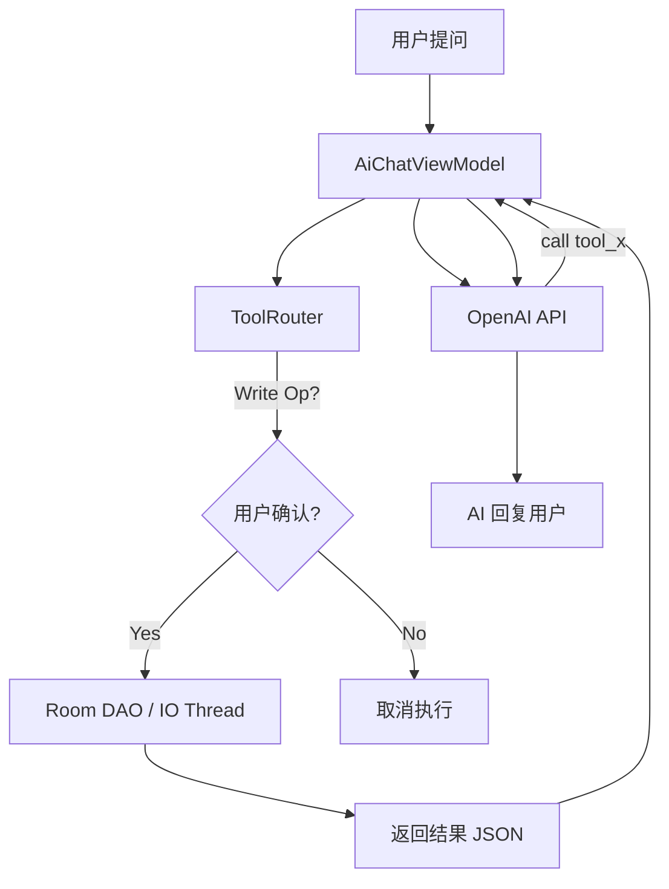

## 一、 项目概述

为 legado 阅读 app 打造一个全能的 **AI 助手**，不仅能进行文学分析，还能通过 OpenAI Function Calling 调用 app 内置方法操作书架、书源、订阅等数据，实现“用嘴管理书架”的体验。

**当前状态**：✅ 已完成核心功能开发、工具调用集成、记忆管理重构及 UI 体验优化。
**当前版本称呼**：统一使用 **“AI 助手”**。

---

## 二、 核心功能模块

### 1. 基础对话与独立入口

- **双重入口**：
  - **阅读模式**：在书籍阅读界面开启，可结合当前章节内容进行对话。
  - **独立模式**：在“我的”页面新增独立入口，无需打开书籍即可管理数据。
- **UI 优化**：
  - 发送按钮在生成期间自动切换为“停止”图标，防止重复提交。
  - 归纳记忆完成后提供 Toast 反馈。

### 2. 工具调用 (Function Calling)

AI 可以直接查询和管理你的书架数据。目前已实现 **16 个** 核心工具：

#### 📖 只读工具（8 个）

- `get_bookshelf`: 获取书架书籍列表
- `search_bookshelf`: 搜索书架书籍
- `get_book_sources`: 获取书源（支持分页）
- `get_rss_sources`: 获取 RSS 订阅源
- `get_reading_stats`: 获取阅读统计
- `get_book_chapters`: 获取书籍目录
- `get_book_groups`: 获取书架分组
- `get_source_groups`: 获取书源/订阅源分组

#### ✏️ 写操作工具（8 个）

- **批量确认类**（合并弹窗）：
  - `update_book_group`: 移动书籍分组
  - `enable_book_source`: 启用/禁用书源
  - `enable_rss_source`: 启用/禁用订阅源
  - `update_book_source_group`: 修改书源分组
  - `create_book_group`: 创建书籍分组
- **逐个确认类**（高风险操作）：
  - `delete_book_source`: 删除书源
  - `delete_rss_source`: 删除订阅源
  - `delete_book`: 从书架移除书籍

### 3. 记忆系统 (Memory Management)

- **结构化存储**：记忆不再是单一字符串，而是 `List<AiMemoryItem>` 结构。
- **管理界面**：新增“查看记忆列表”弹窗，支持分条查阅和删除单条记忆。
- **自动归纳**：支持根据当前阅读章节范围自动总结对话内容。

---

## 三、 开发历程记录

### 2026/05/09 — 名称统一与细节打磨

- **名称统一**：将全项目（Strings, Manifest, Docs, Code Comments）中的“阅读伴侣”、“AI阅读伴侣”等旧称呼统一更改为 **“AI 助手”**。
- **文档完善**：更新 `aiCompanionHelp.md` 使用说明，确保与功能同步。

### 2026/05/08 — 工具调用与独立入口

- **Phase 1 (只读)**：实现 `AiToolDef` 和 `ToolRouter`，支持 8 个只读工具。
- **Phase 2 (写操作)**：实现写操作的 `CompletableDeferred` 确认机制。
- **入口独立**：在 `MyFragment` 增加入口，处理 `isStandalone` 逻辑。
- **Bug 修复**：修复了写操作 DAO 调用未在 IO 线程执行导致失败的问题。

### 2026/05/07 — 记忆管理重构

- **数据模型**：引入 JSON 序列化的记忆列表存储，支持向前兼容。
- **UI 实现**：新增 `AiMemoryDialog` 和 `AiMemoryAdapter`。

---

## 四、 技术架构要点

### 工具执行流

### 关键设计

- **数据精简**：所有工具均返回精简版 JSON，剔除大型字段以节省 Token。
- **分页查询**：书源/订阅源超过 100 条时支持 `offset` 分页。
- **线程安全**：写操作强制使用 `withContext(Dispatchers.IO)` 保证 Room 操作生效。
